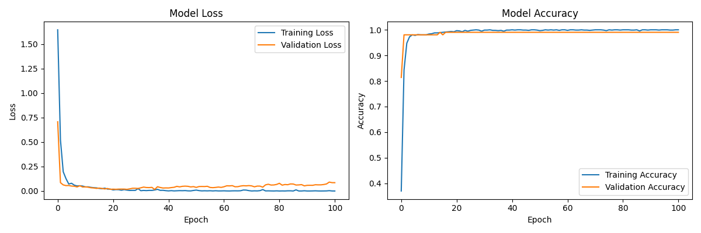

# 🧠 Census Data Chatbot

An AI-powered chatbot that allows users to interact with Indian Census data using natural language queries. This system combines natural language understanding (NLTK), deep learning (TensorFlow), and a Flask-based frontend for an intuitive and intelligent data interface.

---

## 📁 Project Structure

```

census_rag2/
├── clean_csv.py                   # Initial cleaning of raw census data
├── preprocess.py                  # Contains data processing functions used for transformation
├── prepare_census_data.py        # Script to convert cleaned CSV to structured JSON
├── location_data.json            # Output structured census data per location (from prepare_census_data.py)

├── intents.json                  # Intents for training chatbot on user queries
├── train_census_model.py         # Script to train chatbot model using NLTK + TensorFlow
├── training_data.pkl             # Tokenized and vectorized training data
├── chatbot_model.h5              # Final trained neural network model
├── training_history.png          # Training loss/accuracy curve image

├── available_locations.json      # Optional: List of locations chatbot can answer about
├── location_lookup.json          # Name normalization and alias mapping (used in chatbot)

├── census_chat.py                # Core logic to load model, handle intents, and respond
├── ui.py                         # Flask backend to serve chatbot interface
├── index.html                    # Frontend template for chatbot UI
├── analyze_census_data.py        # (Optional) Additional exploration or reporting als created the location_lookup.json file 
├── debug_chatbot.py              # Manual testing & debugging of chatbot responses

├── requirements.txt              # Python dependencies for installation
├── .gitignore                    # Files/folders to exclude from version control
└── README.md                     # 📄 Project documentation (you’re here!)

````

---

## 🚀 Features

- ✅ Natural language queries on census statistics (population, density, ratio, etc.)
- ✅ Structured response for Total, Rural, and Urban data per region
- ✅ Clean and normalized JSON backend from raw census data
- ✅ Custom NLTK + TensorFlow neural network chatbot
- ✅ Flask frontend with simple and interactive chat UI
- ✅ Debugging tools and performance visualizations

---

## 🧠 How It Works

1. **Data Preprocessing (`preprocess.py` & `prepare_census_data.py`)**  
   Converts a cleaned `.csv` file (`feature_engineered_cleaned.csv`) into a JSON format organized by `<Location> <Total/Rural/Urban>`. Includes error handling, numerical conversions, and structure verification.

2. **Intent Classification (`intents.json`)**  
   Defines user intents like population queries, density checks, and rural-urban comparisons. These are used to train the neural network for classification.

3. **Model Training (`train_census_model.py`)**  
   Uses a bag-of-words model with tokenization, lemmatization, and one-hot encoding to train a feed-forward neural network (saved as `chatbot_model.h5`).

4. **Chatbot Engine (`census_chat.py`)**  
   Loads the trained model, interprets user input, matches it to an intent, and fetches data from `location_data.json`.

5. **Frontend (`ui.py` & `index.html`)**  
   Built using Flask. Simple input-output interface where users can ask natural questions about census data.

---

## 🛠 Setup Instructions

### 1. Clone the Repository

```bash
git clone https://github.com/your-username/census_rag2.git
cd census_rag2
````

### 2. Create a Virtual Environment

```bash
python -m venv venv
source venv/bin/activate  # Windows: venv\Scripts\activate
```

### 3. Install Dependencies

```bash
pip install -r requirements.txt
```
### 4. Prepare data for Chatbot 
```bash 
python prepare_census_data.py 
```
### 5. Preprocess text patterns

```bash
python preprocess.py
```

This will read from `feature_engineered_cleaned.csv` and create `location_data.json`.

### 5. Train the Chatbot

```bash
python train_census_model.py
```

This generates the `chatbot_model.h5` and `training_data.pkl`.

### 6. Launch the Web App

```bash
python ui.py
```

Visit [http://localhost:5000](http://localhost:5000) to interact with the chatbot.

---

## 📊 Sample Queries You Can Ask

* `What is the population of Pune Total?`
* `How many towns are there in Bangalore Urban?`
* `Show me the density in Mumbai Rural.`
* `Tell me the male-female ratio for Hyderabad Total.`

---

## 📈 Model Training Details

* **Framework**: TensorFlow (Keras Sequential API)
* **Tokenizer**: NLTK word tokenization + lemmatization
* **Input Vector**: Bag-of-Words with intent classes
* **Output**: Softmax over defined intents
* **Optimizer**: SGD with momentum
* **Loss Function**: Categorical Crossentropy
* **Epochs**: Configurable (default: 200)



---

## 🧪 Testing and Debugging

You can use:

* `debug_chatbot.py` to test the trained model with test phrases
* `analyze_census_data.py` for data exploration
* `available_locations.json` to get all valid `<Location Category>` keys

---

## 📝 File: `preprocess.py`

This script is responsible for:

* Parsing the cleaned CSV data
* Converting values to integers/floats
* Handling missing/NaN values
* Writing a structured JSON file
* Verifying that each location has Total/Rural/Urban entries

Outputs `location_data.json` with clean, queryable structure.

---

## ✅ TODO (For Future Improvements)

* [ ] Integrate Named Entity Recognition (NER) for smarter location detection
* [ ] Add voice input/output with speech recognition and TTS
* [ ] Deploy via Docker or a cloud service (e.g., Render, Heroku)
* [ ] Add pagination & feedback in frontend UI
* [ ] Include charts (e.g., population trends)

---


